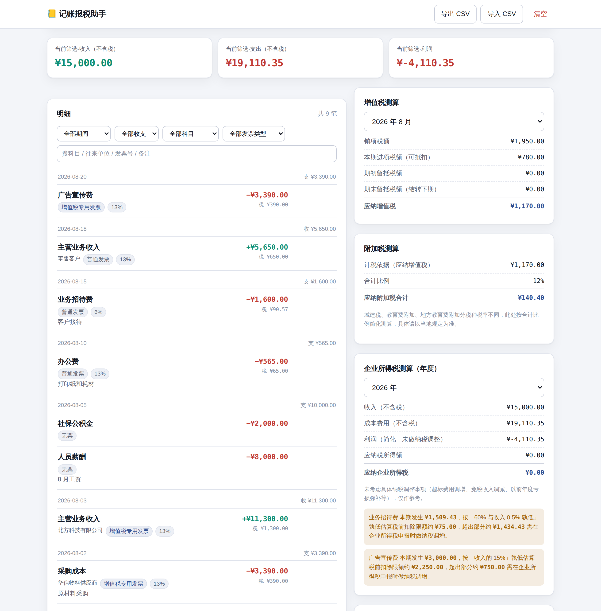

# 记账报税助手

面向中国大陆小微企业/团队的记账与税额测算工具。零依赖、无构建步骤——本地版
双击 `index.html` 就能用；托管版发布成一个可分享链接，手机和电脑打开同一个
链接看到的是同一份账（数据存在 artifact 自己的版本里，不是靠浏览器本地存储）。



## 这不是官方报税系统

**必须先说清楚这一点。** 这是一个记账 + 税额测算工具，帮你把日常收支按增值税、
企业所得税、附加税的规则算出应纳税额、生成申报所需的数字——不对接电子税务局，
不自动申报。任何网页直连自动报税的说法本质上都不可信，因为那需要官方 API 资质
和企业实名认证。正式申报请把测算结果交给会计，或者自己去电子税务局核对后申报。

**所有税率、起征点、扣除比例都是可编辑的示例值**，不代表当前有效政策——中国的
增值税征收率、小微企业所得税优惠、起征点几乎每年都在调，写死在软件里过一阵就是
错的。界面顶部税务参数面板可以随时改成你适用的真实数值，改之前请核实最新政策。

企业所得税测算是简化模型：利润 = 不含税收入 − 不含税成本费用，直接当作应纳税
所得额，**没有做任何纳税调整**（超标费用调增、免税收入调减、以前年度亏损弥补等）。
业务招待费和广告宣传费给了扣除限额的参考提示，但那也只是提示，不会改动测算出的
利润数字，真实申报需要走正式的纳税调整表。

## 用法

```bash
# 本地版：直接打开，数据存在这台设备的浏览器里
open apps/biz-ledger/index.html        # macOS
xdg-open apps/biz-ledger/index.html    # Linux

# 或者起个静态服务器
cd apps/biz-ledger && python3 -m http.server 8000
```

托管版（`hosted.html`）是发布成 Claude Artifact 链接用的版本，运行时会去接
`artifact` 能力把数据存回链接自己的新版本——因此手机和电脑打开**同一个链接**
看到的是同一份账，不需要来回导出导入。改动业务逻辑或界面后，运行：

```bash
node build-hosted.js
```

重新生成 `hosted.html`，再发布这个文件。

## 功能

- **记账**：收入/支出，价税合计（发票上的实际收付金额）+ 税率，自动拆分出
  不含税金额和税额；往来单位、发票号、科目（预设小微企业常用科目，也可自填）
- **发票类型**：无票 / 普通发票 / 增值税专用发票——一般纳税人取得专用发票的
  支出自动判定为可抵扣进项，小规模纳税人一律不可抵扣（按现行规则简化处理）
- **税务参数面板**：纳税人类型（小规模/一般）、申报周期（月/季）、增值税征收率
  与起征点、期初留抵税额、附加税合计比例、企业所得税分档税率、扣除限额参数——
  全部可编辑，改完点保存立即生效
- **增值税测算**：小规模纳税人按不含税销售额 × 征收率、判断是否达起征点；
  一般纳税人按销项减可抵扣进项（含期初留抵结转）
- **附加税测算**：按应纳增值税乘以城建税+教育费附加+地方教育费附加的合计比例
- **企业所得税测算**：按年汇总收入、成本费用、利润，按分档税率算应纳税额；
  业务招待费/广告宣传费扣除限额的参考提示
- **明细与筛选**：按期间（月/季）、方向、科目、发票类型、关键词筛选
- **CSV 导入导出**：往来单位、税率、发票类型、发票号都在列里，坏行会被跳过
  并报出行号，不会因为一行有问题整份失败
- 跟随系统的浅色/深色主题，手机端单栏布局

## 数据说明

**本地版**：数据只保存在这台设备的这个浏览器里，不会上传到任何服务器。清除
站点数据或换设备，记录就没了——用「导出 CSV」备份。

**托管版**：数据存在这个 Artifact 链接自己的版本历史里。链接的所有者和被授予
编辑权限的人（在分享设置里加）都能记账并让所有打开这个链接的人看到最新数据；
只被分享查看权限的人能看账但不能改。顶部的同步状态徽章会告诉你当前是「已同步」
「仅存本机」还是「只读」。

## 代码结构

```
apps/biz-ledger/
├── index.html          本地版页面结构
├── styles.css           样式（CSS 变量 + 浅/深色主题）
├── build-hosted.js      把本地版组装成托管版的构建脚本
├── hosted.html           构建产物：发布到 Claude Artifact 的那个文件
├── js/
│   ├── core.js          纯业务逻辑：金额/税额拆分、校验、增值税/企业所得税
│   │                     测算、CSV —— 不碰 DOM，也不含任何写死的"现行政策"数字
│   ├── storage.js       本地版存储：localStorage 读写
│   ├── hosted-store.js  托管版存储：artifact 能力自发布 + downloads 能力导出
│   └── app.js           渲染与事件绑定，两版共用
└── test/
    └── core.test.js     core.js 的单元测试
```

两个值得知道的实现约定，和实现「链接」这件事本身：

1. **金额一律以「分」为单位的整数存储。** 浮点数做钱的加减会有
   `0.1 + 0.2 !== 0.3` 这类误差，记多了肯定对不上账。
2. **所有用户内容用 `textContent` 写入 DOM，不拼 `innerHTML`。** 往来单位或
   备注里写 `` 只会当成普通文字显示。
3. **托管版怎么做到手机电脑共享同一份账**：页面运行时向 Claude 的 artifact
   能力申请写入权限，每次记账后把「记录 + 税务参数」重新拼成一份完整 HTML
   文档，发布成这个链接的新版本——所有打开这个链接的人（这一个视图也一样）
   都会刷新到最新版本。页面把自己的 CSS/JS 源码放在三个只读的 `<template>`/
   `<style>`/`<script>` 孤岛里，发布时原样读出来重新拼装，不去序列化已经被
   渲染改过的 DOM。发布前会把正在填的表单存进 `sessionStorage`，刷新后放回去，
   免得手一快丢了正在录入的一笔。本地 `localStorage` 还留了一份镜像，只在
   发布失败时当安全网找回数据，不是主数据源。

`core.js` 用 UMD 包装，浏览器里挂在 `window.Ledger`，Node 里可以 `require`，
所以税额计算能脱离浏览器测试。

## 测试

```bash
cd apps/biz-ledger && npm test
```

37 个单元测试，覆盖价税合计拆分的舍入一致性、增值税小规模/一般纳税人两种算法、
留抵结转、企业所得税分档速算、扣除限额提示、CSV 往返与坏行处理、税务参数校验。
需要 Node 18+（内置 `node:test`，没有测试框架依赖）。

浏览器端额外用 Playwright 做过端到端验证（记账、编辑、删除撤销、设置面板联动、
报表数字、CSV 导出、XSS 防护、窄屏布局），以及托管版的自发布循环验证（发布产物
能重新打开、能继续发布、设置和记录都不会在版本之间丢失、备注里的脚本标签不会
截断文档、离线/只读场景正确降级）。

## CSV 格式

```csv
日期,方向,科目,往来单位,价税合计,税率(%),发票类型,发票号,备注
2026-08-01,收入,主营业务收入,A公司,11300.00,13,增值税专用发票,NO-00123,八月销售
2026-08-05,支出,办公费,B商店,113.00,13,普通发票,,打印纸
```

- `方向` 写「收入」/「支出」，也接受 `income` / `expense`
- `价税合计` 是实际收付的金额（含税），系统会按税率自动拆分不含税金额和税额
- `发票类型` 写「无票」/「普通发票」/「增值税专用发票」
- 导入按记录 id 去重，同一份文件重复导入不会产生重复记录

## 许可

MIT，与本仓库一致。
