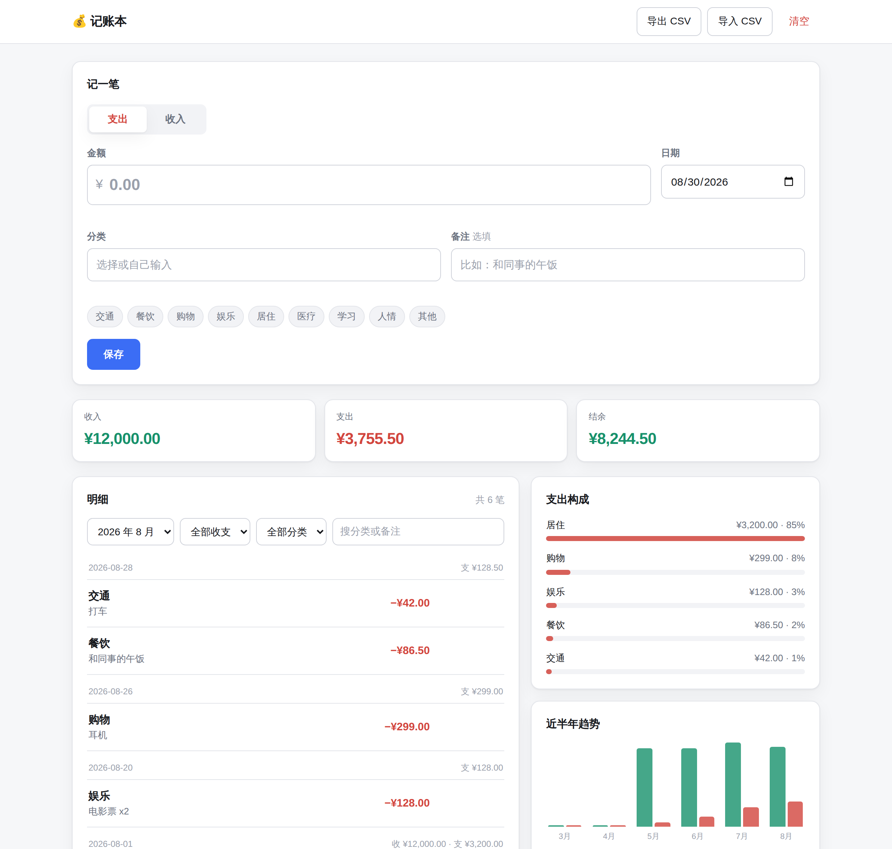

# 记账本

一个零依赖的本地记账应用。没有构建步骤、没有 npm 依赖、没有后端——
双击 `index.html` 就能用，数据存在浏览器的 localStorage 里。



## 用法

```bash
# 方式一：直接打开
open apps/ledger/index.html        # macOS
xdg-open apps/ledger/index.html    # Linux

# 方式二：起个静态服务器（想在手机上访问时用这个）
cd apps/ledger && python3 -m http.server 8000
```

也可以把 `apps/ledger/` 目录直接挂到 GitHub Pages / Netlify / Vercel，纯静态、无需配置。

## 功能

- **记账** — 收入 / 支出、金额、分类、日期、备注；分类既能从预设里点，也能自己输，
  用过的分类会自动排到最前面
- **明细** — 按天分组、显示当天收支小计，支持按月份 / 收支方向 / 分类 / 关键词筛选
- **统计** — 当前筛选范围的收入、支出、结余；支出按分类的占比条；近半年收支趋势图
- **编辑与删除** — 删除后 6 秒内可以「撤销」，不是删了就没了
- **导入导出** — 导出为 CSV（带 BOM，Excel 直接打开不乱码），也能从 CSV 导入；
  导入时坏行会被跳过并报出行号，不会因为一行有问题整份失败
- 跟随系统的浅色 / 深色模式，手机端单栏布局

## 数据说明

数据**只**保存在这台设备的这个浏览器里，不会上传到任何服务器。这也意味着：

- 换浏览器、换设备、清除站点数据，记录就没了 —— 用「导出 CSV」备份
- 隐私模式下浏览器可能不允许写入，这时页面顶部会出现红色提醒
- 用 `file://` 打开和用 `http://localhost` 打开属于不同的源，各自的数据互不相通

## 代码结构

```
apps/ledger/
├── index.html          页面结构
├── styles.css          样式（CSS 变量 + 浅/深色主题）
├── js/
│   ├── core.js         纯业务逻辑：金额解析、校验、汇总、CSV —— 不碰 DOM
│   ├── storage.js      localStorage 读写，全部包了 try/catch
│   └── app.js          渲染与事件绑定
└── test/
    └── core.test.js    core.js 的单元测试
```

两个值得知道的实现约定：

1. **金额一律以「分」为单位的整数存储。** 浮点数做钱的加减会出 `0.1 + 0.2 !== 0.3`
   这类误差，攒够几百笔就会对不上账。展示时才格式化回元。
2. **所有用户内容用 `textContent` 写入 DOM，不拼 `innerHTML`。** 备注里写
   `` 只会当成普通文字显示。

`core.js` 用 UMD 包装，浏览器里挂在 `window.Ledger`，Node 里可以 `require`，
所以业务逻辑能脱离浏览器测试。

## 测试

```bash
cd apps/ledger && npm test        # 等价于 node --test test/core.test.js
```

18 个单元测试，覆盖金额解析的边界、日期校验、筛选排序、CSV 往返与坏行处理、跨年的趋势补齐。
需要 Node 18+（用的是内置的 `node:test`，没有测试框架依赖）。

## CSV 格式

```csv
日期,类型,分类,金额,备注
2026-08-01,收入,工资,12000.00,八月工资
2026-08-28,支出,餐饮,86.50,和同事的午饭
```

- `类型` 写「收入」/「支出」，也接受 `income` / `expense`
- `金额` 填正数，方向由 `类型` 决定
- `备注` 可以为空；含逗号、引号、换行的字段按标准 CSV 用双引号包裹
- 导入按记录 id 去重，同一份文件重复导入不会产生重复记录

## 许可

MIT，与本仓库一致。
